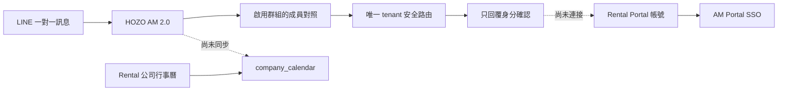
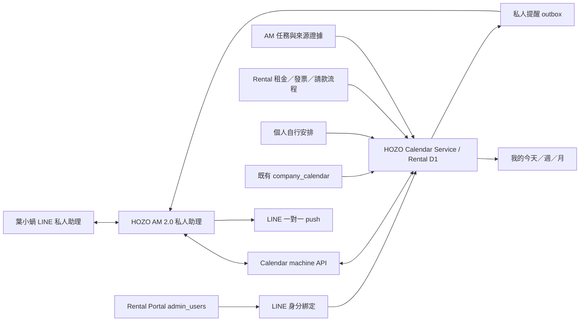

# HOZO 統一行事曆、個人工作追蹤與 LINE 私人助理實作交接規格

更新日期：2026-08-06  
適用系統：HOZO AM 2.0、HOZO Rental、葉小蝸 LINE 官方帳號  
文件目的：交給另一臺電腦的 Codex，依本文件分階段實作、驗證與部署  
文件狀態：規劃完成；一對一 LINE 安全路由已部署，其餘功能待分階段實作

> 這不是單純的畫面需求。它是一個跨 AM、Rental、LINE、帳號權限與通知排程的整合專案。請不要一次把所有功能混在同一個分支或 PR；每一階段都要能獨立驗收、部署與回退。

## 1. 最終目標

建立一個統一的 HOZO 行事曆與個人工作控制中心，讓每位夥伴每天都能清楚看到：

1. 今天的 HOZO AM 2.0 任務。
2. HOZO Rental 的營運事件與流程提醒。
3. 昨天或更早尚未完成、今天需要繼續處理的項目。
4. 夥伴自己預先安排的工作與個人筆記。

同一份資訊需要有兩個入口：

- 主要入口：HOZO Rental 後台的統一行事曆／「我的今天」。
- 快速入口：葉小蝸 LINE 一對一私人助理。

系統要能追蹤來源、負責人、日期、時段、期限、狀態、進度、提醒、延續紀錄與完成證據，並且保持 HOZO AM 2.0 與 HOZO Rental 的資料邊界。

## 2. 核心架構決策

### 2.1 不建立第三份業務正本

各系統仍保有自己的原始資料正本：

| 資料 | 正本系統 | 統一行事曆角色 |
| --- | --- | --- |
| LINE／會議產生的 AM 任務 | HOZO AM 2.0 的租戶資料庫／Notion | 投影、查詢、排程與安全寫回 |
| 租約、房租應收、發票、請款、付款流程 | HOZO Rental D1 | 投影、提醒與導向來源流程 |
| 夥伴自行安排的工作 | HOZO Calendar（Rental D1） | 直接正本 |
| 公司週期性事務 | Rental 既有 `company_calendar` | 保留為週期規則來源並產生實際 occurrence |

統一行事曆是一個「控制與查詢層」，不是把 AM 與 Rental 的完整資料複製到另一個資料庫。

### 2.2 Rental D1 作為 Calendar Service

HOZO Rental 已有帳號、Portal、D1 與 `admin-calendar`，因此統一行事曆服務應建在 Rental：

- Rental D1 儲存統一索引、個人規劃、提醒、身分綁定與稽核紀錄。
- Rental 後台提供 `我的今天／週／月` 畫面。
- AM 透過專用 machine API 讀寫 Calendar Service。
- AM 保有 LINE webhook 與 LINE push 的唯一責任。

Google Calendar 不作為第一階段正本。它無法完整承載任務證據、流程狀態、權限、稽核與財務安全規則；未來只能做選用的唯讀或受控同步。

### 2.3 到期日與個人安排日必須分開

- `due_at`：原始系統的正式期限，不得因夥伴延到明天而被偷偷修改。
- `planned_date`／`planned_start_at`：夥伴今天打算何時處理。

「延到明天」只改個人安排，不改租約、請款、發票或 AM 任務的正式期限。

### 2.4 carry-over 是紀錄，不是完成狀態

未完成延續到隔天時：

- 任務狀態仍是 `planned`、`in_progress`、`waiting` 或 `blocked`。
- 更新個人 `planned_date`。
- 新增一筆 `carried_over` 稽核紀錄。
- 增加 `carry_over_count`。

不得複製出另一筆相同任務，也不得把 `carried_over` 當成任務完成狀態。

## 3. 目前已存在且已打通的部分

以下是 2026-08-06 的快照；另一臺電腦開始工作前仍須重新核對 GitHub、正式站與環境設定。

### 3.1 HOZO Rental 已有公司行事曆

正式入口：`https://rental.hozorental.com/admin-calendar`

已確認：

- 正式頁面可回應 HTTP 200。
- 未登入呼叫 `/api/calendar` 會回 401，表示 API 有登入保護。
- Rental D1 有 `company_calendar`。
- 頁面已有清單與月曆檢視。
- 可建立每週、每月、每季、每半年、每年與單次事項。
- 可設定文字負責人、分類、提前天數、備註、啟用／停用。
- 可標記「本期完成」，以 `last_done_period` 記錄。

目前限制：

- 它是公司定期事務表，不是完整的個人任務系統。
- 負責人只是文字，`只看我負責的` 也是名稱包含比對，不能作為權限依據。
- 每一期沒有獨立 occurrence、狀態歷程與完成證據。
- 沒有 AM 任務同步。
- 沒有 Rental 業務事件自動投影。
- 頁面內 SOP 仍明確寫著 LINE 自動提醒屬後續階段。

相關 Rental 程式：

- `admin-calendar`
- `admin-calendar.html`
- `_worker.js` 的 `ensureCompanyCalendarSchema`、`handleCalendar` 與 `/api/calendar`

### 3.2 HOZO AM 2.0 已有任務與提醒底座

HOZO AM 2.0 已載入 `tasks`、`reminders`、`meetings`、`triage`、`queue` 等模組，租戶已有 `tasks`、`events`、`messages`、`meetings`、`groupBindings` 等資料源。

目前 `tasks` 模組可處理：

- 建立待辦。
- 設定負責人文字、期限、來源與狀態。
- 改狀態。
- 查詢尚未完成且有期限的任務。
- 記錄提醒是否已發送。

目前提醒主要推到負責群組，不是推到每位夥伴的一對一 LINE；AM 任務也尚未使用 Rental `admin_users.id` 作為穩定的負責人 ID。

### 3.3 一對一 LINE 身分預綁定與私人路由已部署

AMCore 升級包：`AM-IMP-2026.0806.02`

已部署的行為：

1. 收到 LINE 一對一事件時，以穩定的 `LINE userId` 查詢 HOZO AM 2.0 正式啟用群組的 `成員對照`。
2. 只有唯一租戶命中才成立；未知、跨租戶重複、查詢失敗、停用群組與影子群組一律 fail closed。
3. 私人訊息只進入 `onDirectMessage`。
4. 私人訊息不會進入原本的群組 `collect`、`triage`、`meetings` 或任務抽取流程。
5. 輸入 `我的身分`、`身分`、`綁定狀態` 或 `我是誰`，會回覆目前辨識到的 HOZO AM 2.0 身分。

相關 AM 程式：

- `core/direct-line.js`
- `core/router.js`
- `core/modules.js`
- `modules/personal-assistant/index.js`
- `tenants/hozo-am-2-0.json`
- `tools/dryrun-personal-line-routing.mjs`
- `versions/AM-IMP-2026.0806.02/`

正式環境 `/health` 已確認 HOZO AM 2.0 同時 requested 與 loaded `personal-assistant`。這只證明模組已載入；仍需由一位已知夥伴送出新的私人訊息，確認實際 LINE 回覆與 Render event log，才算完成使用者行為驗證。

### 3.4 Rental Portal 與 AM 已有 SSO

Rental 已有 `admin_users.id`、角色、專案與功能權限；Rental 與 AM 之間已有短效 handoff 與 Portal session 驗證：

- Rental：`/api/am-sso/start`、`/api/am-sso/consume`、`/api/am-sso/verify`
- AM：`/portal/sso`

這代表 Rental 的 `admin_users.id` 可以作為夥伴的 canonical `person_id`。但目前 LINE 預綁定尚未把 `LINE userId` 與 `admin_users.id` 正式連接，所以還不能安全讀取個人 Rental 或 Calendar 資料。

### 3.5 目前尚未打通的部分

下列功能尚未完成，不可在文件、UI 或對外說明中宣稱已上線：

- LINE 身分與 Rental 後台帳號的明確綁定。
- `我的今天`、`昨天未完`、個人待辦與行事曆查詢。
- AM 任務同步到統一行事曆。
- Rental 房租、發票、請款、審核與放行提醒投影。
- 一對一 LINE 主動提醒。
- 個人任務建立、完成、改期、carry-over 與歷程。
- AM 任務從 Calendar 或 LINE 安全寫回。

## 4. 目前與目標資料流

### 4.1 目前



### 4.2 目標



## 5. 完整身分綁定設計

目前的群組成員對照只能當成「預綁定資格」，不能直接授權讀取 Rental 私人資料。完整綁定必須把 LINE 身分連到 Rental 的正式使用者帳號。

### 5.1 canonical person

- canonical `person_id`：Rental `admin_users.id`。
- LINE 識別：LINE webhook 的穩定 `userId`。
- 顯示名稱只能顯示，不得作為綁定、查詢或授權鍵。
- 每次讀取私人資料前，要確認使用者仍為 active 且仍有 HOZO AM 2.0／Calendar 權限。

### 5.2 建議的正式綁定流程

1. 夥伴先登入 HOZO Rental Portal。
2. 在個人設定點選「綁定葉小蝸 LINE 私人助理」。
3. Rental 建立一次性綁定碼，效期 5 分鐘，只能使用一次。
4. 夥伴到葉小蝸一對一 LINE 輸入 `綁定 123456`。
5. AM 先執行目前既有的唯一租戶／群組成員預檢。
6. AM 透過 AM→Rental 專用 machine token 呼叫綁定 consume API，送出 tenant、一次性碼與 LINE userId。
7. Rental 驗證一次性碼、登入帳號、active 狀態與功能權限後，建立正式 identity link。
8. Rental 回傳最小必要資料：`personId`、`displayName`、角色與 Calendar capabilities。
9. AM 回覆「已綁定到哪一個 Portal 帳號」與可使用的命令。
10. 使用者或管理員都可以撤銷；停權時即時 fail closed。

### 5.3 身分資料儲存

建議新增 `calendar_identity_links`：

| 欄位 | 用途 |
| --- | --- |
| `id` | link ID |
| `tenant_key` | `hozo-am-2-0` |
| `person_id` | Rental `admin_users.id` |
| `line_user_id_hash` | 以 secret HMAC 產生，供唯一查詢 |
| `line_user_id_ciphertext` | 供主動 push 使用的加密值 |
| `status` | `pending` / `active` / `revoked` |
| `verified_method` | `portal_one_time_code` |
| `verified_at` | 完成時間 |
| `last_verified_at` | 最近權限驗證 |
| `revoked_at`、`revoked_by` | 撤銷稽核 |

加密與 HMAC 金鑰只能放在正式環境 secret，不得進 Git、MD、log 或 API response。

### 5.4 身分安全條件

- 一個 LINE userId 在同一 tenant 只能綁定一個 active person。
- 一個 person 預設只允許一個 active LINE 帳號；若未來要多裝置，需另立規則。
- 綁定碼不能放在 URL query log；consume 使用 POST body。
- 綁定碼儲存 hash，不儲存明碼。
- 綁定與撤銷都寫 audit log。
- 查詢失敗、token 不一致、使用者停權、功能被撤銷時一律不回私人資料。

## 6. 統一資料模型

實際表名前可加 `hozo_` 或 `calendar_` 前綴；下列名稱是契約語意。所有 schema 必須 additive、idempotent、向後相容。

### 6.1 `calendar_items`

每筆代表一個可顯示、追蹤或操作的實際事項。

| 欄位 | 說明 |
| --- | --- |
| `id` | Calendar item UUID |
| `tenant_key` | tenant 邊界 |
| `title`、`description` | 標題與必要摘要 |
| `item_kind` | `task` / `event` / `workflow` / `checkpoint` |
| `source_system` | `hozo_am` / `hozo_rental` / `manual` |
| `source_type` | `am_task` / `meeting` / `rent_receivable` / `invoice_issue` / `claim` / `payment_review` / `company_series` / `personal` 等 |
| `source_id` | 原始系統 ID |
| `occurrence_key` | 週期事項的日期或期別；非週期可為空 |
| `source_version` | 來源版本／updated_at，用於衝突檢查 |
| `source_url` | 回到正本系統的安全網址 |
| `owner_person_id` | canonical person ID |
| `participant_person_ids_json` | 其他參與人 |
| `visibility` | `private` / `team` / `role_based` / `company` / `admin_only` |
| `project_id`、`property_id` | 選填的專案／館別範圍 |
| `scheduled_date` | 系統建議或共享排程日 |
| `start_at`、`due_at` | 開始與正式期限 |
| `timezone` | 預設 `Asia/Taipei` |
| `status` | 統一任務狀態 |
| `workflow_state` | 請款、審核、放行等來源流程狀態 |
| `priority`、`risk_level` | 優先與風險 |
| `action_policy` | `view_only` / `safe_writeback` / `source_only` |
| `requires_human_action` | 是否需要人工處理 |
| `idempotency_key` | 唯一鍵 |
| `source_updated_at`、`last_synced_at` | 同步時間 |
| `created_at`、`updated_at`、`closed_at` | 歷程時間 |

唯一鍵建議：

```text
tenant_key + source_system + source_type + source_id + occurrence_key
```

### 6.2 `calendar_person_plans`

儲存每位夥伴自己的安排，不改正本期限。

| 欄位 | 說明 |
| --- | --- |
| `calendar_item_id` | 對應事項 |
| `person_id` | 夥伴 |
| `planned_date` | 自己安排在哪一天 |
| `planned_start_at`、`planned_end_at` | 自己安排的時段 |
| `personal_note` | 個人筆記；只回給本人 |
| `pinned` | 是否置頂 |
| `snoozed_until` | 暫緩到何時 |
| `carry_over_count` | 延續次數 |
| `updated_at` | 最近調整 |

主鍵：`calendar_item_id + person_id`。

### 6.3 `calendar_item_sources`

保存來源證據的引用，不把完整租客或財務資料複製進 Calendar。

| 欄位 | 說明 |
| --- | --- |
| `id`、`calendar_item_id` | 關聯 |
| `source_system`、`source_type`、`source_id` | 原始來源 |
| `source_url` | 正本連結 |
| `source_summary` | 最小必要摘要 |
| `evidence_ref` | 訊息、會議、資料列或流程事件引用 |
| `captured_at` | 取得時間 |

AM 任務必須保留 LINE／會議／報告等來源證據。無來源證據的 AM 候選任務不得被 Calendar 顯示成已確認正式任務。

### 6.4 `calendar_item_logs`

每次建立、改期、完成、阻塞、延續、同步與寫回都要記錄：

- actor type 與 actor ID。
- action。
- old value 與 new value。
- reason／note。
- evidence reference。
- request／idempotency ID。
- created_at。

### 6.5 `calendar_reminders`

| 欄位 | 說明 |
| --- | --- |
| `calendar_item_id`、`person_id` | 提醒對象 |
| `remind_at` | 預定時間 |
| `channel` | `line_direct` / `dashboard` / `email` |
| `status` | `pending` / `leased` / `sent` / `failed` / `cancelled` |
| `dedupe_key` | 防止重複發送 |
| `attempt_count`、`last_error` | 重試資訊 |
| `sent_at` | 成功時間 |

### 6.6 `calendar_sync_cursors` 與 `calendar_sync_failures`

- 每一個來源 adapter 保存自己的 cursor／last successful time。
- 同步失敗不能靜默跳過。
- 失敗需要可重跑、可稽核，不可因重跑建立重複 item。

### 6.7 既有 `company_calendar` 的處理

不要直接刪除或改名。

第一階段保留它作為 recurrence series 來源，由伺服器端產生實際 occurrence 到 `calendar_items`。完成情況改為 occurrence 級紀錄；舊的 `last_done_period` 在過渡期仍更新，以保持舊 UI 相容。

## 7. 統一狀態與流程語意

### 7.1 通用任務狀態

只使用：

- `planned`
- `in_progress`
- `waiting`
- `blocked`
- `done`
- `cancelled`

`overdue` 是由 `due_at` 與現在時間計算出的顯示條件，不是儲存狀態。`carried_over` 是 log action，不是狀態。

### 7.2 workflow 狀態

請款、審核與付款必須保留來源流程語意，例如：

- `submitted`
- `pending_review`
- `approved`
- `rejected`
- `pending_release`
- `released`
- `failed`
- `void`

不得把「已審核」當成「已付款」，也不得把「已核准」當成「已放行」。Calendar 只能顯示目前階段與下一位負責人。

## 8. Rental 資料 adapter

### 8.1 房租繳交與催收

正式來源應使用 Rental 的 `finance_receivables`：

- `receivable_type = rent`
- `due_date`
- `amount_due`、`amount_paid`
- `status = unpaid / partial / overdue / paid / void`

Calendar 只保存最小摘要、館別／房號遮罩、期限、狀態與來源連結。房客個資、銀行資料與完整金額明細不得送進一般 LINE 提醒。

建議提醒：到期前、到期日、逾期後依公司政策分級。已付或 void 時自動關閉提醒。

### 8.2 發票開立

Rental 目前 `invoices.due_date` 是付款期限，不能直接推定為「應開立發票日期」。

實作前必須先確認正式發票流程；若系統沒有明確欄位，新增 `invoice_issue_due_at`、`invoice_issued_at` 與負責人，不得挪用付款到期日。

### 8.3 請款、核准、審核與放行

請先盤點正式 claims／payables／bank payment review 的實際資料表與狀態，再建立 mapping。可參考：

- AM `modules/claims/index.js` 的 Rental claim intake 與 event callback 契約。
- Rental `finance_payables`。
- Rental `finance_bank_payment_reviews`。
- Rental `finance_bank_payment_review_attempts`。
- 實際請款 intake 所建立的 claim source table。

每個流程階段要產生一個可追蹤的 workflow item 或更新同一 item 的 `workflow_state`，並顯示「目前等誰處理」。

安全硬規則：

- LINE 不得核准請款。
- LINE 不得執行審核、放行、付款、網銀操作、OTP 或憑證操作。
- Calendar 不得繞過 Rental 正式財務權限。
- LINE 與 Calendar 只通知、顯示最小摘要並導向登入後的 Rental 正式頁面。

## 9. HOZO AM 2.0 adapter

### 9.1 任務投影

AM 任務同步時至少帶：

- AM task page ID。
- 內容摘要。
- 正式狀態。
- 期限。
- 專案／負責群組。
- 來源類型與來源證據引用。
- `owner_person_id`；若無法可靠對應，保留為未指派，不可用顯示名稱猜測。
- source updated time／version。

### 9.2 穩定負責人 ID

AM 現有 `負責人` 是文字，後續需新增可選的穩定欄位，例如 `負責人ID`，值使用 Rental `admin_users.id`。畫面仍可顯示人名，但權限與私人查詢只能用穩定 ID。

### 9.3 同步策略

採「事件推送 + 定期 reconciliation」：

1. AM 建立或更新任務後，送一筆 idempotent event 到 Rental Calendar API。
2. 每 10～60 分鐘執行 reconciliation，補回漏掉的事件。
3. 同步時以 source ID、occurrence key 與 source version 判斷 insert／update／ignore。
4. Calendar 寫回 AM 時使用 optimistic concurrency；來源已變更則回 409，要求重新讀取。

### 9.4 初期寫回限制

第一個可上線版本先做 AM 任務唯讀投影與來源連結。完成唯讀穩定性後，才開放：

- `planned → in_progress`
- `in_progress → done`
- 改個人 planned date，不改 AM due date

敏感、高風險或缺乏證據的 AM 任務仍須回 AM 正式頁面處理。

## 10. Calendar UI 設計

既有 `/admin-calendar` 應逐步升級，不另建一個讓夥伴找不到的入口。需同時維護 `admin-calendar` 與 `admin-calendar.html` 完全一致。

### 10.1 預設畫面：我的今天

```text
┌─────────────────────────────────────────────────────┐
│ 我的今天  2026-08-06   [今天] [週] [月] [團隊]      │
│ [全部] [AM] [Rental] [個人]              [+ 新增]   │
├─────────────────────────────────────────────────────┤
│ 今日摘要：AM 3｜Rental 4｜昨日未完 2｜我的安排 3    │
├─────────────────────────────────────────────────────┤
│ 09:00  昨日未完：整理續約資料       [延續第 1 天]   │
│ 10:30  AM：確認會議待辦             [進行中]        │
│ 14:00  個人：整理明日會議資料       [待辦]          │
│ 16:00  Rental：房租催收確認         [來源連結]      │
│ 17:30  Rental：請款待審核           [僅查看／前往]  │
└─────────────────────────────────────────────────────┘
```

### 10.2 必備檢視

- 我的今天：四類資訊同頁呈現。
- 昨日未完：批次選擇今天繼續、改期、完成或維持等待。
- 週檢視：看工作量與空檔。
- 月檢視：看期限、週期事項與重要流程節點。
- 團隊檢視：只顯示使用者有權限的 team／role items。
- 來源篩選：AM、Rental、個人、公司週期事務。

### 10.3 item 詳情

每一筆至少顯示：

- 來源系統與類型。
- 正式期限與個人安排時間。
- 負責人與可見範圍。
- 目前狀態／workflow state。
- 原始來源連結。
- 最近狀態變更與證據摘要。
- 可做的安全操作。

### 10.4 個人任務

快速新增欄位：

- 標題。
- 日期與開始／結束時間。
- 優先級。
- 個人筆記。
- 提醒時間。
- 是否公開給團隊；預設 `private`。

個人筆記預設只有本人可讀，不得因管理者可看團隊進度就自動公開內容。

## 11. LINE 私人助理設計

### 11.1 指令

第一批正式指令：

- `我的身分`
- `我的今天`
- `昨天未完`
- `這週`
- `新增待辦 明天下午三點 整理續約資料`
- `完成 3`
- `延到明天 2`
- `提醒我 16:00 2`
- `幫助`

### 11.2 防誤操作

- 自然語言新增要先回傳解析結果，再由使用者確認。
- 清單中的短編號只在該使用者、該次查詢、短效時間內有效。
- 初期 `完成` 只允許本人建立的個人任務。
- AM 任務寫回要等 Phase 7 安全閘門完成。
- Rental 財務與流程項目永遠只提供查看與來源連結。
- 不明確日期、時間、負責人或重複項目時先詢問，不直接建立。

### 11.3 一對一主動提醒

主動提醒不是 webhook reply，必須使用 LINE push。實作前確認：

- 使用者已加官方帳號／未封鎖，且 LINE 平台允許 push。
- 使用者已完成正式身分綁定與通知 opt-in。
- quiet hours 預設 22:00～08:00。
- 同一事項、同一提醒時間有 dedupe key。
- 失敗要記錄 LINE status、重試次數與 fallback。
- 不在 LINE 內容放租客姓名、帳號、付款明細或敏感附件。

## 12. 每日節奏

### 12.1 早上

預設 08:30 私人摘要：

1. 今天 AM 任務。
2. Rental 營運／流程提醒。
3. 昨天未完。
4. 自己安排的工作。
5. 時間衝突與今天最重要三件事。

### 12.2 白天

- 期限前提醒。
- 等待回覆／阻塞狀態提醒。
- 流程輪到本人處理時通知。
- 使用者可在 LINE 或 UI 改個人安排。

### 12.3 晚上

預設 20:30 收尾：

- 勾選完成。
- 尚未完成的項目選擇明天、改期、等待或阻塞。
- 系統不得默默把所有項目複製到隔天。
- `auto_next_workday` 只可用在使用者明確開啟的個人任務。
- AM／Rental 來源項目只調整個人 plan，不改正式期限。

## 13. API 契約建議

### 13.1 Browser session API（Rental）

- `GET /api/calendar-v2?view=today&scope=mine&date=YYYY-MM-DD`
- `GET /api/calendar-v2/items/:id`
- `POST /api/calendar-v2/items`
- `PATCH /api/calendar-v2/items/:id`
- `POST /api/calendar-v2/items/:id/complete`
- `POST /api/calendar-v2/items/:id/carry-over`
- `POST /api/calendar-v2/line-bindings/code`
- `DELETE /api/calendar-v2/line-bindings/current`

全部使用 Rental 登入 session 與 user scope，不接受 browser 自行指定別人的 `person_id`。

### 13.2 AM→Rental machine API

- `POST /api/integrations/calendar/line-bindings/consume`
- `POST /api/integrations/calendar/identity/resolve`
- `POST /api/integrations/calendar/items/upsert`
- `POST /api/integrations/calendar/query-my-day`
- `POST /api/integrations/calendar/personal-items/create`
- `POST /api/integrations/calendar/personal-items/action`
- `POST /api/integrations/calendar/reminders/lease`
- `POST /api/integrations/calendar/reminders/ack`

### 13.3 Rental→AM machine API

後續寫回與提醒需要：

- `POST /control/calendar/task-events`
- `POST /control/calendar/reminder-events`

使用兩個方向分開的高熵 token，避免一個 token 同時具備雙向全部權限。token 值不得出現在 repo、文件、health response 或 browser payload。

所有 machine write 都要：

- Bearer／專用 header 驗證。
- `Idempotency-Key`。
- tenant key。
- request ID。
- 最小 body。
- timeout。
- 重試安全。
- audit log。

## 14. 權限與資料隔離

### 14.1 visibility

- `private`：只有 owner 本人。
- `team`：明確關聯的群組／團隊。
- `role_based`：如財務角色。
- `company`：所有 active 公司帳號。
- `admin_only`：最高管理或指定管理角色。

### 14.2 必測邊界

- A 使用者不能查到 B 的 private task 或 personal note。
- 同名夥伴不能互相命中。
- 停權使用者立即失去 LINE 與 Portal 存取。
- 未綁定 LINE userId 不回私人資料。
- 跨 tenant 重複 userId fail closed。
- AM 任務無穩定 owner ID 時不得猜測個人歸屬。
- Rental 財務資料依原角色、館別與功能權限裁切。
- machine API token 錯誤、缺少或方向不符時回 401／403。

## 15. Roadmap 與 PR 切分

### Phase 0：基線確認與契約凍結

目標：確認另一臺電腦看到的正本與正式環境，避免在舊 clone 或髒工作區施工。

工作：

1. 重新確認 GitHub `origin/main`、Render／Cloudflare 正式版本與 active PR。
2. 核對 Rental 正式 claims table、invoice flow、payables workflow 與現有 migration 編號。
3. 核對 HOZO AM 2.0 正式 Notion task schema 與 owner 資料品質。
4. 以一位測試夥伴完成 `我的身分` 新鮮 LINE 行為驗證。
5. 凍結 API、status mapping、visibility 與資料表契約。

完成門檻：產出 read-only inventory；不修改正式資料。

### Phase 1：正式 LINE 帳號綁定與 Calendar foundation

目標：建立 `person_id ↔ LINE userId` 與 Calendar V2 additive schema。

Rental PR：

- identity link／one-time code schema。
- Calendar tables、indexes、ensure functions。
- browser binding API。
- machine identity resolve／consume API。
- audit、idempotency、auth tests。

AM PR／upgrade package：

- 將現有 group-map 預綁定延伸成 Rental 正式 identity resolve。
- `綁定 123456` 與撤銷提示。
- fail-closed dry run。

完成門檻：一位測試夥伴能把同一個 LINE userId 綁到正確 Rental `admin_users.id`；另一位使用者無法讀取其資料。

### Phase 2：我的今天與個人待辦

目標：先讓夥伴可以在 Rental UI 使用完整個人工作追蹤。

工作：

- 升級 `admin-calendar` 與 `.html`。
- 我的今天／昨日未完／週／月。
- 個人任務 CRUD。
- 個人 plan、筆記、完成、改期與 carry-over log。
- 保留既有公司週期事務並產生 occurrence。

完成門檻：不接 AM／Rental 自動來源時，個人待辦與既有公司行事曆已能每天可靠使用。

### Phase 3：HOZO AM 2.0 任務唯讀整合

目標：在「我的今天」看到有來源證據的 AM 任務。

工作：

- AM task event adapter。
- Rental upsert endpoint。
- owner person ID mapping。
- backfill 與 reconciliation。
- source link／evidence summary。
- duplicate、update、delete／cancel mapping tests。

完成門檻：AM 任務建立或改狀態後，在 SLA 內只出現一筆正確 Calendar item，且來源可追溯。

### Phase 4：Rental 營運與流程提醒

依序導入，不要同一 PR 全做：

1. 房租應收與催收。
2. 發票開立時點。
3. 請款待審核。
4. 核准後待放行。
5. 已放行／失敗／退回。

每一個 adapter 各自有 mapping、權限、去重、關閉與回退測試。

完成門檻：來源狀態改變會正確更新或關閉 Calendar item，且 Calendar 不會修改財務正本。

### Phase 5：LINE 查詢與個人待辦操作

目標：夥伴可以用葉小蝸快速看與安排工作。

工作：

- `我的今天`、`昨天未完`、`這週`。
- 新增個人待辦的解析與二次確認。
- 完成／延到明天／提醒我。
- 短效 item number。
- 私人資料遮罩與訊息長度處理。

完成門檻：新鮮 LINE event 實測成功，且不產生群組訊息、AM candidate task 或跨人資料。

### Phase 6：私人主動提醒與每日摘要

目標：08:30、到期前與 20:30 可可靠通知每位 opt-in 夥伴。

工作：

- Rental reminder outbox。
- AM lease／send／ack。
- LINE push delivery log。
- dedupe、retry、quiet hours、blocked user fallback。
- 使用者通知偏好。

完成門檻：指定測試帳號收到一次且僅一次正確提醒；發送失敗可在後台看見原因。

### Phase 7：安全寫回 AM 與流程強化

目標：可在 Calendar／LINE 完成低風險 AM 任務，同時保持來源一致。

工作：

- AM machine task update API。
- optimistic concurrency。
- evidence append。
- conflict UI。
- 只開放 allowlist 狀態轉換。

財務 workflow 仍維持來源頁面處理，不在本階段開放 LINE 核准或放行。

### Phase 8：選用外部行事曆同步

完成前七階段後，才評估 Google Calendar／Outlook：

- 預設建立專用 HOZO calendar，不寫個人 primary calendar。
- 初期只同步有明確時間的項目。
- 私人筆記、來源證據、財務明細不外流。
- 取消同步時不能刪除內部正本。

## 16. 另一臺 Codex 的開工步驟

### 16.1 先閱讀規則

在任何修改前：

1. 完整閱讀 AMCore 根目錄 `AGENTS.md`。
2. 完整閱讀 Rental 根目錄 `AGENTS.md` 與 `CONTRIBUTING.md`。
3. 查閱現有 Draft PR，避免與 `_worker.js`、migration、`admin-calendar` 重疊。

### 16.2 使用正確工作區

Rental 的 GitHub `origin/main` 是唯一程式正本。不要在 Google Drive 同步 clone 或目前已有大量他人修改的工作區開發。

建議：

```powershell
$repoRoot = "C:\CodexRepos\rental-management-blueprint"
$featurePath = "C:\CodexWorktrees\rental-management-blueprint\hozo-calendar-foundation"

git -C $repoRoot fetch origin --prune
git -C $repoRoot worktree add `
  -b codex/hozo-calendar-foundation `
  $featurePath `
  origin/main
```

先確認：

```powershell
git status --short --branch
git branch --show-current
git rev-parse --show-toplevel
```

不得在 `main` 修改；不得用 `git add .`、`git add -A` 或 `git commit -am` 夾帶他人變更。

### 16.3 第一個執行範圍

先只做 Phase 0 與 Phase 1，不要直接做到完整 UI 或財務 adapter。

第一個 Rental PR 建議名稱：

```text
codex/hozo-calendar-foundation
```

第一個 AM upgrade package 請使用執行當日下一個未占用的 `AM-IMP-YYYY.MMDD.NN`，不要假設固定版號。必須包含：

- `README.md`
- `upgrade.json`
- `INSTALL.md`
- `VERIFY.md`
- `ROLLBACK.md`
- machine-readable identity／calendar contract
- dry-run tests

AMCore 只保存共享程式、契約與 upgrade package；正式 person、LINE userId、任務、租客、財務與通知資料不得進 AMCore Git。

## 17. 測試與驗收矩陣

### 17.1 schema 與 recurrence

- ensure 重跑不失敗、不重複欄位、不破壞舊表。
- 每月 31 日遇小月使用月底。
- 季／半年／年 occurrence 不重複。
- 舊 `company_calendar` 可繼續讀寫。
- occurrence 完成只影響該期。

### 17.2 identity

- exact LINE userId 才能命中。
- display name 相同或改名不影響身分。
- unknown／ambiguous／revoked／inactive fail closed。
- 綁定碼過期、重複使用、錯誤 user、錯誤 tenant 都拒絕。
- A 使用者不能綁定或查詢 B 的帳號。

### 17.3 Calendar

- 今日四類資料正確分組。
- 昨日未完不複製 item。
- carry-over 不改 due date。
- private note 不出現在 team、admin digest 或 LINE log。
- 同一來源事件重送 10 次仍只有一筆 item。
- source update 較舊時不得覆蓋新狀態。

### 17.4 AM sync

- 建立、更新、完成、取消都正確 mapping。
- 無來源證據的 candidate 不顯示成 confirmed task。
- 無 person ID 不猜 owner。
- Calendar 寫回衝突回 409，不靜默覆蓋。

### 17.5 Rental adapter

- rent paid／void 後停止催收。
- `invoices.due_date` 不被誤當發票開立日。
- submitted、approved、reviewed、released 不混用。
- Calendar／LINE 不可觸發付款、放行、OTP 或憑證流程。

### 17.6 LINE

- direct message 不進 group modules。
- 一次查詢不洩漏別人的 item。
- 新增待辦需二次確認。
- push 只有一次，失敗可追蹤。
- 封鎖、未 follow、超額或 LINE API 失敗時有 fallback。

### 17.7 Rental 專案必要檢查

依 Rental `CONTRIBUTING.md` 至少執行：

```powershell
node --check _worker.js
node scripts/check-admin-usage-counter.mjs
node scripts/finance-rent-recognition.test.mjs
git diff --check
git diff --no-index --exit-code -- admin-calendar admin-calendar.html
```

並新增 Calendar 專屬測試。新增檔案時檢查 `.gitignore` allowlist。

### 17.8 AM 必要檢查

使用 bundled Node（若 `node` 不在 PATH）後，至少執行：

```text
node --check server.js
node --check core/router.js
node --check core/direct-line.js
node --check core/modules.js
node --check modules/personal-assistant/index.js
node tools/dryrun-personal-line-routing.mjs
node tools/check-upgrade-package.js <NEW_PACKAGE_ID>
node tools/audit-module-authorization.mjs
node tools/audit-alignment.js
```

若 audit 因其他租戶既有問題失敗，必須記錄精確原因，不可把未通過寫成通過。

## 18. 部署與正式驗證

### 18.1 Rental

只能：

```text
功能分支／獨立 worktree
→ tests
→ Draft PR
→ review + CI
→ merge GitHub main
→ GitHub Actions 部署
→ 正式站 smoke test
```

禁止本機或功能分支直接以 `--branch=main` 部署。Pages 部署不會自動執行 D1 migrations；正式 schema 必須使用冪等 `ensureXSchema`，除非另有核准的 remote migration 計畫。

### 18.2 AM

依 AMCore upgrade package 流程安裝到 HOZO AM 2.0，先本機 dry run，再部署實際 AM Platform production service。只有正式 `/health`、logs 與新鮮 LINE 行為都通過後，manifest 才能標記 `Deployed`。

### 18.3 每一階段的 production proof

每階段都保存：

- GitHub main commit SHA／PR。
- deploy ID／Actions run。
- schema ensure 結果。
- API 401／403／成功案例。
- 指定測試帳號的 UI 與 LINE 實際結果。
- 沒有跨人、跨 tenant 或財務越權的證據。

## 19. Feature flags 與回退

建議分開控制：

- `calendarV2.enabled`
- `calendarV2.amSyncEnabled`
- `calendarV2.rentalAdaptersEnabled`
- `personalAssistant.calendarEnabled`
- `personalAssistant.proactivePushEnabled`

回退原則：

1. 先關閉有問題的 adapter、LINE command 或主動 push。
2. Rental `/admin-calendar` 可回到舊公司行事曆模式。
3. AM `personal-assistant` 仍可保留身分確認，不讀私人資料。
4. additive tables 與 logs 保留，不急著刪除。
5. 程式回退使用 revert PR，不 reset／force push main。
6. 財務來源資料永遠不因 Calendar 回退而刪除或改寫。

## 20. 完成定義

只有全部符合時，才能稱為「HOZO 統一行事曆已完成」：

- 每位已授權夥伴都有唯一 `person_id ↔ LINE userId` 綁定。
- `我的今天` 同時看得到 AM、Rental、昨日未完與個人安排。
- 個人任務可以新增、安排時間、完成、改期與保留個人筆記。
- carry-over 有歷程且不改正式期限、不製造重複任務。
- AM 任務有來源證據、穩定 owner 與同步稽核。
- 房租、發票、請款、審核與放行提醒來自 Rental 正本狀態。
- Calendar 與 LINE 不可直接執行財務核准、放行或付款。
- LINE 私人查詢與通知不洩漏其他夥伴、租客或財務敏感資料。
- 早晚摘要與到期提醒有 dedupe、quiet hours、失敗追蹤與 opt-in。
- 每一階段都有測試、PR、正式 deployment proof 與可執行回退方案。

## 21. 給接手 Codex 的第一句指令

```text
請先完整閱讀本文件、AMCore/AGENTS.md、Rental/AGENTS.md 與 Rental/CONTRIBUTING.md。
先執行 Phase 0 的只讀盤點，確認 GitHub origin/main、正式資料表、現有 PR、正式 API 與一對一 LINE 行為。
盤點完成後，只實作 Phase 1「正式 LINE 帳號綁定與 Calendar foundation」，使用獨立分支、非雲端同步 worktree、additive schema、專用 machine token、完整測試與 Draft PR；不要直接修改 main、不要直接部署、不要開始財務 workflow 或 LINE 主動 push。
```
