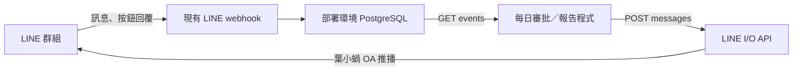

# LINE 群組 Input / Output API

狀態：**Ready（可安裝套件；各正式環境狀態記於該專案 manifest）**。

「葉小蝸 AI 小助手」可作為其他程式共用的 LINE 收送介面。外部程式負責每日審批、判斷與報告；本 API 負責保存群組輸入並把程式提供的文字送回授權群組。外部程式只需自己的 API key，不需要取得 OA 的 LINE channel token。



## 呼叫方式

Base URL 是葉小蝸正式服務的 HTTPS 網址，這個套件不預設或宣稱已有正式 URL。

所有端點需 `Authorization: Bearer <你的專用 API key>`。

| API | 用途 |
| --- | --- |
| `GET /api/v1/line/groups` | 列出此 key 可用、且仍有效綁定的群組與所屬目標 ID |
| `GET /api/v1/line/events?after=0&limit=100` | 依接收順序讀取保存的群組事件，包含文字、媒體參照、postback 與 unsend |
| `POST /api/v1/line/messages` | 以 OA 身分推播文字到指定授權群組 |

發送報告範例（`groupId` 從 groups API 取得）：

```http
POST /api/v1/line/messages
Authorization: Bearer <API_KEY>
Content-Type: application/json
Idempotency-Key: daily-review-2026-09-28-part-1

{"groupId":"<授權群組 ID>","text":"今日審批檢查：待確認 3 項。完整報告：https://example.com/reports/today"}
```

成功回應：

```json
{"status":"accepted","groupId":"<群組 ID>","idempotencyKey":"daily-review-2026-09-28-part-1","requestId":"<LINE request ID>","messageIds":["<LINE message ID>"],"replayed":false}
```

`accepted` 代表 LINE 接受請求，不代表成員已收到、閱讀或核准。相同 key + 相同內容會回傳先前結果；同 key 改收件群組或內容回 `409 idempotency_conflict`。Key 在每個租戶／client 內唯一；一份跨群報告需為各群分配不同 key。變更報告內容時使用新的版本 key。

讀取輸入範例：

```json
{
  "events": [{
    "cursor": "123",
    "receivedAt": "2026-09-28T00:00:00.000Z",
    "tenantKey": "sample-project",
    "groupId": "<群組 ID>",
    "bindingId": "<綁定 ID>",
    "projectId": "<目標 ID 或 null>",
    "event": {
      "type": "message", "webhookEventId": "<事件 ID>", "timestamp": 1790553600000,
      "source": {"type":"group","groupId":"<群組 ID>","userId":"<發話者 ID>"},
      "message": {"type":"text","id":"<訊息 ID>","text":"請提供今日審批清單"}
    }
  }],
  "nextCursor": "123",
  "hasMore": false
}
```

外部程式先成功保存／處理整頁，再保存 `nextCursor`；`hasMore=true` 時繼續讀下一頁。Cursor 是十進位**字串**，不可轉成 JavaScript Number。按 `webhookEventId` 對業務操作去重，才能在重啟或處理失敗後安全重讀。多個程式各自保存 cursor，互不消耗對方的訊息。更改 client 的群組授權集合後，新增群組的舊資料需以新 cursor 流程補讀。

可直接交給其他程式的檔案：

- [Python 呼叫範例](examples/line_io_client.py)：Python 標準函式庫，沒有第三方依賴。
- [OpenAPI 規格](openapi.json)：三支 API 的機器可讀契約。
- [安裝](INSTALL.md)、[驗證](VERIFY.md)、[回退](ROLLBACK.md)。

## 第一版範圍與資料行為

- 沿用現有 `POST /webhook/line`；不要另外覆蓋 LINE Console 的 webhook 指向其他程式。
- 每個 key 固定一個租戶、明確群組清單與 read/write scopes；每次 API 存取重新確認現有群組綁定。影子記錄群組可讀、不可推播。
- 收到已授權群組事件後，驗簽、確認綁定、以 PostgreSQL transaction 保存，最後才回 webhook 200。資料庫失敗回 503；需在 LINE Console 啟用 webhook redelivery。LINE 本身不保證所有事件最終送達，API 也不能補回從未收到的事件。
- 只保存啟用後且配置了 `events:read` 的群組事件；不回溯 LINE 舊聊天紀錄。可設定 `transportOnly=true`，使指定群組只走收送介面；其他群組的既有 AM 模組仍依原流程運作；本套件不提供既有模組的持久化工作佇列。
- 保留發話者 ID、來源時間、事件 ID、訊息／postback 內容、媒體 ID 與來源目標，供審批或任務留存依據；不外洩 replyToken／quoteToken。`projectId=null` 時由業務程式補足目標脈絡。
- 媒體只提供 webhook 原有的參照與 metadata，**此版不提供附件下載或主動 callback**。圖檔、PDF 可由原系統的附件歸檔處理；報告可用文字附上使用者可存取的報告網址。
- 文字每次最多 4,900 個 UTF-16 code units，超過會回 400，不會截斷。長報告由呼叫端分段並使用不同 key。此版不產生 Flex 審批按鈕；既有按鈕的 postback 可讀取。
- `unsend` 事件會清掉本 API 已存原訊息的 message 內容，保留 tombstone 與來源 ID；晚到的原訊息也不會恢復內容。外部程式收到 unsend 後應同步移除自己的副本。既有其他 AM 資料庫的留存行為不在此套件範圍。
- 發送前持久保存 retry UUID，逾時重試仍用同一 UUID。未決請求超過 23 小時回 `retry_window_expired`，需人工查核，不自動換 key 再送。成功紀錄／去重 key 不自動刪除；正式環境需設定備份、容量與保留政策，不可刪除去重資訊後繼續沿用舊 key。
- API 只傳遞審批輸入，不代表群組每位成員都有審批權。外部程式需以 `source.userId`、審批項目 ID、自己的權限與狀態機核對；涉及財務、合約等的最終確認仍屬專案負責人。

## 錯誤處理

| HTTP | error | 呼叫端處理 |
| --- | --- | --- |
| 400 / 413 / 415 | 輸入格式、大小或 key 無效 | 修正請求 |
| 401 / 403 | 未授權、scope 不足、群組不可用 | 校正金鑰／群組綁定，不前移 cursor |
| 409 | `idempotency_conflict` | 同 key 不能改內容 |
| 409 | `send_in_progress` | 等至少 `Retry-After: 30` 秒，使用原 key 重試 |
| 409 | `retry_window_expired` | 人工查核 LINE 是否已接受，不自動換 key |
| 502 / 503 | `line_send_failed` / `service_unavailable` | 檢查服務，有限次退避重試，保留原內容與 key |

本 API 的服務端失敗回應可能代表「LINE 已接受但本地結果尚未保存」，不可因此改用新的 key。端點只用於伺服器程式；不要把 key 放入前端或 LINE 群組。

LINE 官方依據：[Webhook 驗簽](https://developers.line.biz/en/docs/messaging-api/verify-webhook-signature/)、[群組訊息](https://developers.line.biz/en/docs/messaging-api/group-chats/)、[接收訊息／重送／收回](https://developers.line.biz/en/docs/messaging-api/receiving-messages/)、[發送重試與 24 小時有效期](https://developers.line.biz/en/docs/messaging-api/retrying-api-request/)。

## 固定人員窗口

Client 可設定 `inputUserIds` 白名單；message/postback 只對該清單保存及提供，unsend 等系統事件仍保存。安裝 AM-IMP-2026.0929.02 後，POST 的 `notifyUserId` 可指定每次發送的 @收件人；省略沿用 client 設定，null 不 @；同一次 LINE push 包含一則 @提醒及一則報告文字。這是群組通知，不是私訊，群內其他成員仍可看到報告。`transportOnly=true` 的群組不交給既有 AM 會議／任務／財務指令處理。直聊不在本套件範圍。

## 通知人參數（API 1.1.0）

發送 body 可包含 `notifyUserId`：有效 U 開頭的 32 位 hex user ID、且需可驗證為目標群成員。省略採用設定的預設通知人，明確 null 則取消 @。同一個 Idempotency-Key 更換通知人會回 409；通知人格式错误回 400，非群成員回 403，查核暫時失敗回 503。詳細升級說明見 AM-IMP-2026.0929.02。
