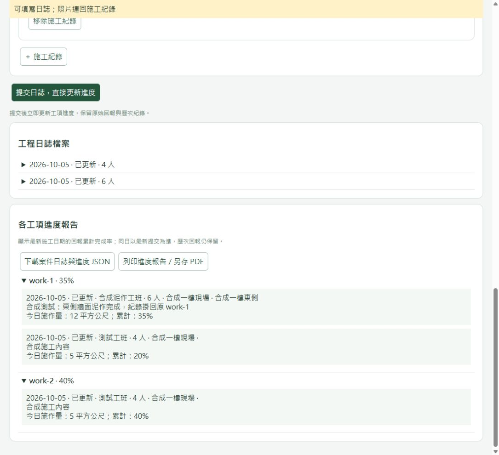
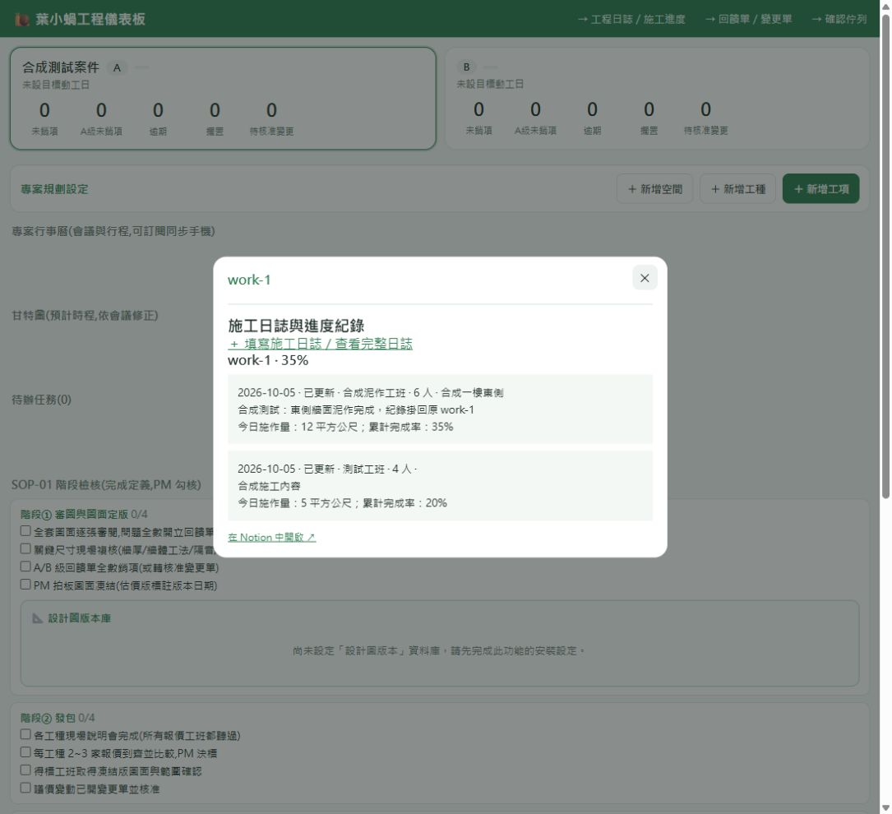

# AM-IMP-2026.1005.01 工程日誌與施工進度檔案

狀態：Ready（共用程式與本機合成資料驗證完成；尚未建立正式資料庫或部署）。

已確認需求：以 AM 工程網頁表單回報為主，LINE／原有報表可補登。新日誌提交後直接更新進度，不需管理者確認。正式服務與原有資料位置仍待接入。

## 使用方式

從工程儀表板進入「工程日誌／施工進度」，開啟案件，填實際施工日期、工班、工種與進場人數。每筆施工紀錄選原有工項，填位置、內容、今日施作量／單位、累計完成率、障礙、下一步；可選已歸檔照片或上傳 JPEG／PNG／WebP。日誌送出後，可以在同頁查看每日檔案與各工項歷次進度，下載 JSON 或列印／另存 PDF。

一個案件包含多份日誌；一份日誌包含多個工班與多筆施工紀錄。人數在工班層記一次；工項引用工班，不重複計算。重複的同名工班／同工種會拒絕提交，避免多算人數。同一份日誌同一工項合併成一筆，未知人數顯示待補，確定無人填 0。不同時段的同一工班需合併去重後填當日人數，本版不是出勤簽到系統，也不把多份日誌的人數相加為當日唯一人數。

每筆施工紀錄關聯「日誌、案件、現場空間、原有工項」，有權限時再選預算項目與合約。新資料庫使用雙向關聯，在原有現場空間／工項／預算／合約頁面形成施工紀錄的反向連結；不另建同名工程，亦不改金額。Notion 可能產生預設反向欄名，可在 Notion 改成「施工進度紀錄」。參見 [Notion 官方關聯欄位說明](https://developers.notion.com/reference/property-object#relation)。

在工程儀表板的「空間 × 工種」矩陣點開原有工項，原內容下方顯示「施工日誌與進度紀錄」，包含日期、工班、人數、內容、數量、完成率、照片與來源。新增日誌入口預選該工項；同空間同工種的多個工項全部可開。現場空間、預算與合約詳情也依原關聯顯示自己的紀錄，保留各自檢視權限。

## 資料與進度判斷

- 工程日誌：實際施工日期、原始回報、工班／工種／人數、來源、填報者與更新時間；舊版確認欄位保留相容。
- 施工進度紀錄：連原有工項與日誌，保存施工內容、位置、施作量、累計完成率、照片、障礙與下一步。
- 現場照片：Drive 保存原檔；工程租戶 Notion 保存索引、案件、日期與上傳者；可引用已歸檔 LINE 圖片。尚未指定案件的 LINE 照片須先在原有確認佇列完成案件歸屬。
- LINE／報表補登必填來源參照與原文，例如群組、時間、發話者、報表檔案或頁面連結；施工日期與保存時間各自保留。來源參照上限 1,000 字、原文上限 8,000 字，超長時要求分段或附檔案參照，不靜默截短。施工位置、單位、照片說明、障礙與下一步也按欄位上限拒絕超長內容。
- 提交後「已更新」，施工索引全部保存成功即納入工項進度，不需管理者確認。舊版待確認資料保留既有操作路徑。
- 使用最新施工日期的有效累計百分比，同一施工日期以最新成功更新時間為準，所有舊回報仍保留。不累加每日百分比、不由人數或發包金額推算施工率。管理者可作廢錯誤日誌後重報，保留原文、舊版確認與作廢原因。重複作廢視為重送，不覆蓋第一次作廢的操作者、原因與時間。
- 未填施工百分比時仍累積內容、數量與照片。施工回報不等於驗收、付款或合約完成；施工日誌目前也不直接變更既有工項狀態或建立正式任務。
- 障礙與下一步連原始日誌，是後續任務判斷的證據。接入既有任務調和流程時須先載入判斷規則、尋找既有任務、通過來源證據閘門；不把每筆日誌都變成新任務。

## 可操作示範

`node tools/preview-construction-journal.mjs` 啟動 localhost:4319。全部為記憶體內合成資料、示範身分，關閉程序即消失；不連 Notion／Drive，不支援真實上傳，勿輸入正式資料。正式應用使用現有 AM Portal 登入與案件 scope。

## 限制與安裝邊界

本版適用單一寫入程序，程序內序列化與提交識別碼支援重送及中斷復原。Notion 無跨頁交易，先保存原文、再建立施工索引，全部成功後才解除「整理中」。正式環境若有多個可並行寫入的實例，須先接分散式鎖與唯一鍵儲存後才能啟用寫入。本機預览不可作为正式服務。

單日可多份回報，每份最多 40 工班、40 工項、每工項 20 張照片，單張 20 MB，完整原始回報 JSON 上限 40,000 字元。大報表請分段補登。照片只有魔術位元與 MIME 檢查，並非內容審查；未成功掛上施工紀錄的上傳保留在同案件的照片索引，不任意刪除。Drive 成功、Notion 索引失敗時需管理者依案件日期資料夾找回檔案。

僅安裝到 AM Platform 啟用 construction 的租戶。HOZO／Seven 非工程租戶與舊 BuildAM 回退服務不安裝。本套件不包含正式案件、預算數據、訊息、資料庫 ID、token 或環境檔。部署須從目前正式服務版本整合，不能把此舊分支與原有未提交變更一起推送。
